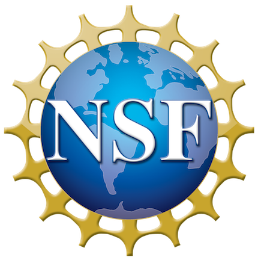

# Universal Dependencies Workshop 2020 (UDW 2020)

### [Coling 2020](https://coling2020.org), Barcelona,  September 14, 2020

[Universal Dependencies](http://universaldependencies.org/) (UD) is a
framework for cross-linguistically consistent treebank annotation that
has so far been applied to over 80 languages.

The framework is aiming to capture similarities as well as
idiosyncracies among typologically different languages (e.g.,
morphologically rich languages, pro-drop languages, and languages
featuring clitic doubling). The goal in developing UD was not only to
support comparative evaluation and cross-lingual learning but also to
facilitate multilingual natural language processing and enable
comparative linguistic studies.

**Invited speaker**: Martha Palmer, University of Colorado Boulder, USA

**Note regarding the COVID-19 pandemic**: Like the COLING 2020 organizers, we remain optimistic that the workshop can take place in Barcelona in September. We will closely monitor the developments  and will inform you as early as possible in case we have to make alternative arrangements. We will also provide opportunities for remote presentations to presenters who cannot attend in person due to potentially remaining travel bans. 

### Sponsored by

   

