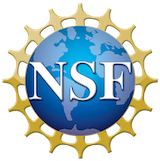

# Universal Dependencies Workshop 2020 (UDW 2020)

### [Coling 2020](https://coling2020.org), online, December 13, 2020 (new date and now online!)

[Universal Dependencies](http://universaldependencies.org/) (UD) is a
framework for cross-linguistically consistent treebank annotation that
has so far been applied to over 90 languages.

The framework is aiming to capture similarities as well as
idiosyncracies among typologically different languages (e.g.,
morphologically rich languages, pro-drop languages, and languages
featuring clitic doubling). The goal in developing UD was not only to
support comparative evaluation and cross-lingual learning but also to
facilitate multilingual natural language processing and enable
comparative linguistic studies.

**Invited speaker**: Martha Palmer, University of Colorado Boulder, USA

### Sponsored by

   

