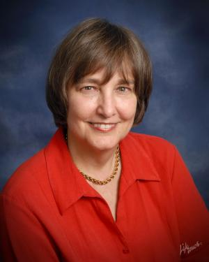

# Invited Talk: Martha Palmer, University of Colorado Boulder

## Transcending Dependencies

This talk will discuss some of the challenges arising from the Blocks World scenario in the DARPA Communicating with Computers program.  The actions are very simple and concrete, such as “Add a block to the tower.”  However, even in this restricted world, getting the appropriate contextual interpretation of a sentence can be challenging, especially with respect to spatial relations and implicit information.  The talk will review the progress we have made so far on collecting useful data that comprises complete 2 person dialogues discussing block structure constructions,  and our attempts to  achieve the goal of contextual interpretation in the processing of these dialogues.  A main focus will be the ways in which we are expanding AMR annotation to encompass spatial relations and the recovery of implicit arguments.  Both expansions play into the task of maintaining a discourse structure and producing the predicate logic sentence representations needed by the down-stream planner.  The talk will conclude with our current AMR parsing results, our attempts to pass them along to the planner, and our future goals.

## Bio

Martha Palmer is the Helen & Hubert Croft Endowed Professor of Engineering in the Computer Science Department, and an Arts & Sciences Professor of Distinction in the Linguistics Department, at the University of Colorado, with a split appointment. She is also an Institute of Cognitive Science Faculty Fellow, a co-Director of CLEAR, an ACL Fellow, and a AAAI Fellow. She  was the Director of the 2011 Linguistics Institute in Boulder, CO. Her research is focused on capturing elements of the meanings of words that can comprise automatic representations of complex sentences and documents in English, Chinese, Arabic, Hindi, and Urdu, funded by DARPA, DTRA and NSF. A more recent focus is the application of these methods to biomedical journal articles and clinical notes, funded by NIH. She co-edits LiLT, Linguistic Issues in Language Technology, and has been a co-editor of the Journal of Natural Language Engineering and on the CLJ Editorial Board.  She is a past President of ACL, past Chair of SIGLEX, was the Founding Chair of SIGHAN, and has over 300 peer-reviewed publications. 

 
